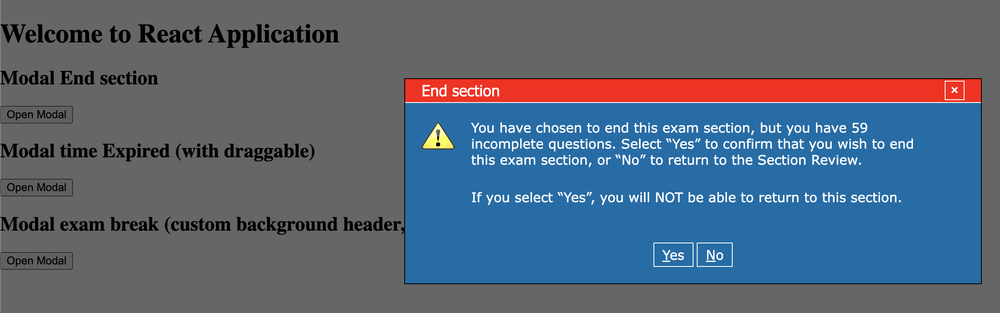

# Clone this project :
git clone https://github.com/GrimonprezAlexis/modal-mcat

## Run App 
Install npm dependencies using `npm install`
Use `npm start` to run open [http://localhost:3000](http://localhost:3000) to view it in your browser.# modal-mcat

